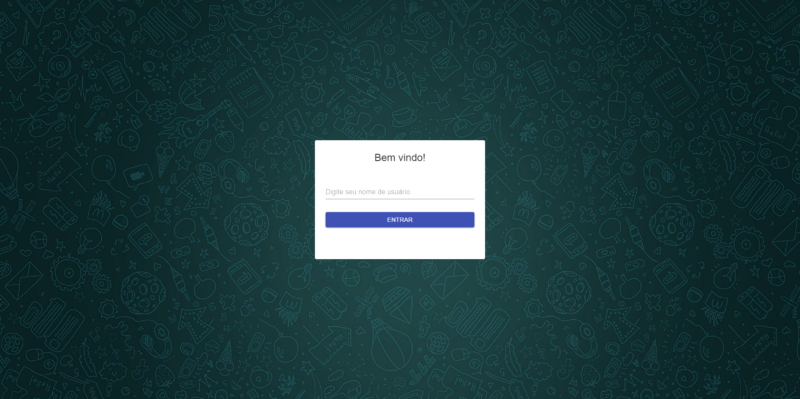
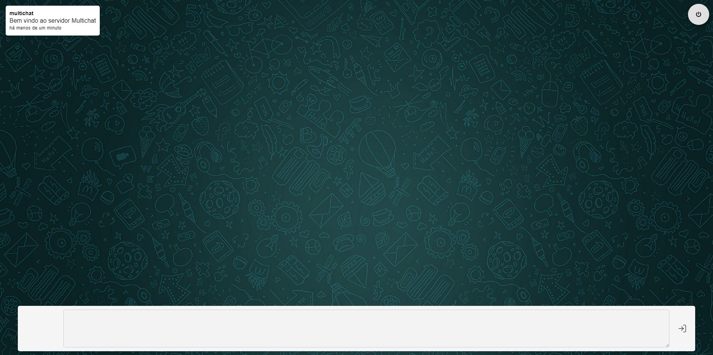

# Multichat

Multichat é uma aplicação para conversa em tempo real onde é possível iniciar uma conversa com vários usuários, primeiro é necessário informar um username para entrar como observador, para interagir em uma sala é necessário completar seu cadastro informando email e data de nascimento.

A sala principal do servidor é a rota raíz do sistema `http://localhost:3000/`, mas também é possível criar uma sala específica alterando a url, por exemplo `http://localhost:3000/nova-sala`.

## Tela de login

## Sala de chat

## Configuração inicial

Entre na pasta backend pelo terminal e execute o comando `yarn ou npm i`.

Entre na pasta frontend pelo terminal e execute o comando `yarn ou npm i`.

## Executando o projeto

Entre na pasta backend pelo terminal e execute o comando `yarn dev ou npm run dev`, o servidor por padrão roda na porta `3333`.

Entre na pasta frontend pelo terminal e execute o comando `yarn start ou npm start`.

## Executando os testes

Entre na pasta backend pelo terminal e execute o comando `yarn test ou npm test`.

# API

## Rotas disponíveis

-   Listar usuários - `GET` http://localhost:3333/users

-   Cadastrar usuário - `POST` http://localhost:3333/users

### Corpo esperado na requisição para cadastro de usuário

    {
    	"username": "matheus",
    	"email": "admin@admin.com",
    	"birth_date": "1998-05-01"
    }
